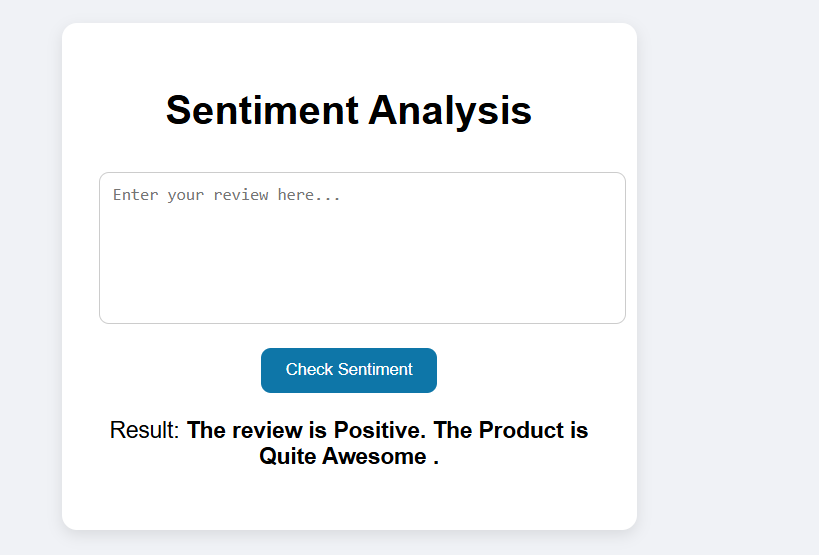
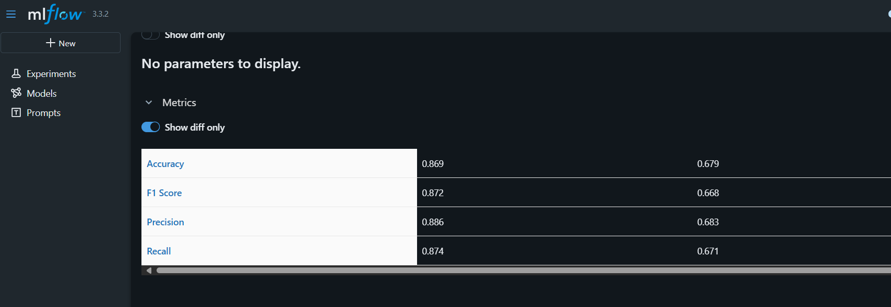

# 💳 Ecommerce Website reviews Sentiment Analysis- Web Application

A modern, Interactive User Interface , can classify sentiment of E-commerce website into three category- ['Positive','Negative','Neutral'] .


## 🚀Web App Preview



## TechStacks

- **Flask**: User interface creation 
- **Scikit-learn**: For machine learning capabilities and text preprocessing .
- **Pandas**: For data manipulation
- **NumPy**: For numerical computing


## 🏗️ Architecture

``` 
ecommerce_sentiment_analysis/
├── data/              # Trained model files
│   ├── balanced
│   └── cleaned
         # Main Streamlit application
├── dashboard.py          # Dashboard component class
├── utils.py              # Utility functions and helpers
├── config.py 
├── app.py                 # Main Streamlit application
├── dashboard.py          # Dashboard component class
├── utils.py              # Utility functions and helpers
├── config.py             # Configuration and constants
├── requirements.txt      # Python dependencies
├── README.md            # This file
├── models/              # Trained model files
│   ├── random_forest_fraud.pkl
│   └── logistic_regression_fraud.pkl
└── data/                # Data files (optional)
    └── creditcard.csv

```

### ✨ How to Start 
1. **create new virtual environment and activate it**
```bash 
python -m venv myenv

myenv/Scripts/activate
```

2. **install dependencies**
```bash
pip install -r requirements.txt
```
3. **Run data_cleaning notebook  , Cleaned Data has been saved into data/cleaned**
```bash
notebooks/data_cleaning.ipynb
```
3. **Before execution of Mlflow and Run the Below command in Command prompt**
```bash 
mlflow ui   
```

4. **text preprocessing check : scripts/data_preprocessing.py  and Run Both notebook from the train folder** . 
``` bash
train/Naive_Bayes_Classifier.ipynb
Xboost_tuned.ipynb
```

5. **If you want can save the model or you can find the model from below paths :**
``` bash
- check the model id : mlruns/models/<model_name>/version-1/meta.yaml
- mlartifacts/0/models/<model-id>/model.pkl
```

6. **Set this path into Process.py file**:
``` bash
pipelines/process.py
```

7. **Run the app.py**
``` bash 
python app.py
```

8. **check the logs of User from the below path**
``` 
logs/User logs.log
```
9. **Open your browser**
   - Navigate to `http://localhost:8000`
   - The application will open automatically

### 📊 Challenges Faces :
- Imbalanced Dataset Handle 
- Memory Optimization 
- text Cleaning 

### 🔧 Professional Features
- **UI Interface**: interactive user interface with sentiment and reviews.
- **Scraping Real time Reviews from ecommerce website**: Used Selenium to scrape real time reviews from amazon.in [path: scripts/data_scraping.py]
- **Error Handling**: Graceful fallbacks and user-friendly error messages.
- **Logs**: User logs has been created . 
- **Mlflow Tracking**: Model performance tracking and testing using mlflow.


## 🎨 Customization

### Data
create your own dataset `data/raw` to process:


### Styling
Modify the CSS in `app.py` to customize:
- Colors and gradients
- Layout and spacing
- Typography and effects

### Adding Models
1. Train your model using scikit-learn
2. Save as `.pkl` file in the `mlartifacts\0\models` directory
3. Update `model path` in `pipelines\process.py`


### What I have Learned 
- how to handle Imbalanced dataset in texts. 
- creating pipeline (count vectorizer + model ).
- how to handle memory limit. 
- how to create github workflows.
- How to improved accuracy by 15%. 



**Data Validation Errors**
- Check CSV format and column names
- Ensure Sentiment in number. 

**Performance Issues**
- Large files (>100MB) may be slow
- Consider data sampling for testing
- Check available system memory

### Getting Help
1. Check the error messages in the application
2. Verify your data format matches requirements
3. Ensure all dependencies are installed
4. Check the console for detailed error logs.


## 🚀 Future Enhancements

### Planned Features
- **Cloud Monitory using Mlflow**: using mlflow with AWS or Sagamaker.
- **Fast Api**:  creating fastAPi .

### Contributing
1. Fork the repository
2. Create a feature branch
3. Make your changes
4. Test thoroughly
5. Submit a pull request

